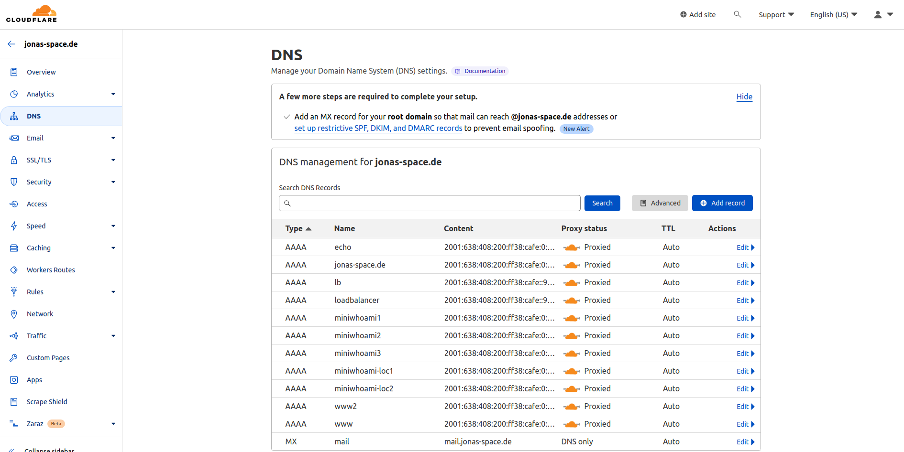
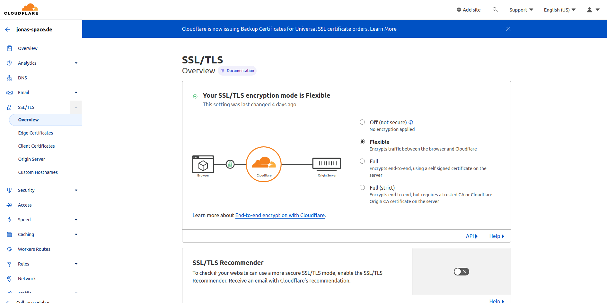

# Reverse-Proxy

- Creation of a web-server accessible via IPv6 in a local subnet.
- Configuration of a IPv6 reverse proxy


## Task 1 - Nginx

- "normal" webserver with nginx

a) Choose service address 

Set server network address: 2001:638:408:200:ff38:cafe::7777/64

b) Create nginx-Server via docker-compose and configuration files

- Serves responsive website.
- Has IPv6 address
- Additionally connected to local IPv6-Network. (Created in the previous week)
- Callable via domain name (Configure DNS service)
- Additionally deny access via IP address

c) Used configuration files:

`nginx.conf`

```bash
events {
worker_connections  4096;  ## Default: 1024
}

http {
    server {
        sendfile on;
        sendfile_max_chunk 1m;

        listen 80;
        listen [::]:80;
        server_name www.jonas-space.de jonas-space.de;
        
        # Only allow access if the host is correct
        set $test 0;
        if ( $host != "www.jonas-space.de" ){
            set $test 1;
        }
        #if ( $host != "jonas-space.de" ){
        #    set $test 1;
        #}
        if ( $test = 1 ){
            return 444; #CONNECTION CLOSED WITHOUT RESPONSE
        }

        location / {
          include /etc/nginx/mime.types; # Wandelt die http content-type headers zu konkreten Datei Endungen um
          root /usr/share/nginx/html; # Alle filesystem Operationen hiernach nehmen diesen Ordner als Root Ordner
          index index.html; # Setzt die Datei index.html im html Ordner als index HTML Datei
        }
    }
}
```

`docker-compose.yml`

```yml
version: "3.9"
services:
reverse-proxy:
    container_name: reverse-proxy
    image: nginx:latest
    networks:
    my_ipv6:
        ipv6_address: 2001:638:408:200:ff38:cafe::7777
    loc_ipv6:

    volumes:
    - ./nginx.conf:/etc/nginx/nginx.conf:ro
    - ./site-content:/usr/share/nginx/html
    #- ./access.log:/var/log/nginx/access.log

    environment:
    - ENABLE_IPV6=true
    restart: unless-stopped

networks:
my_ipv6:
    external: true
loc_ipv6:
    external: true

```

**Question:** Why is it usefull for the service to be only accessible via domain-name. (Not via IP-address)

> Disabling direct access to services is usefull when using load-balacing or reverse-proxy.


## Task 2 - HTTPS Server

a) Create secure HTTPS server

Created certificate via Certbot. Expires on 13.02 and has to be renewed manually.
  https://certbot.eff.org/instructions?ws=nginx&os=ubuntufocal

```
Successfully received certificate.
Certificate is saved at: /etc/letsencrypt/live/www.jonas-space.de/fullchain.pem
Key is saved at:         /etc/letsencrypt/live/www.jonas-space.de/privkey.pem
This certificate expires on 2023-02-13.
These files will be updated when the certificate renews.

NEXT STEPS:
- This certificate will not be renewed automatically. Autorenewal of --manual certificates requires the use of an authentication hook script (--manual-auth-hook) but one was not provided. To renew this certificate, repeat this same certbot command before the certificate's expiry date.
```

HTTPS connection works after the `nginx.conf` was edited as following:
```
nginx config...
```

**Wildcards missing**

Switch to cloudflare





`nginx.conf`
```bash
server {
    listen 80;
    listen [::]:80;
    #listen 443 ssl;
    #listen [::]:443 ssl;
    server_name www2.jonas-space.de;

    if ($http_x-forward-proto = http){
      return 301 www2.jonas-space.de;
    }

    location / {
      include /etc/nginx/mime.types; # Wandelt die http content-type headers zu konkreten Datei Endungen>
      root /usr/share/nginx/html; # Alle filesystem Operationen hiernach nehmen diesen Ordner als Root O>
      index index.html; # Setzt die Datei index.html im html Ordner als index HTML Datei
    }
  }

```


## Task 3 - Reverse Proxy

Create docker services running inside local network make them accessible via nginx reverse proxy subdomain: `miniwhoami-loc1.yourDomain.xy`


Steps:

Each service has to be added to:
1. CDN-service providers DNS service.
2. server entry inside nginx.conf with specified location:
```bash
    server {
    listen 80;
    listen [::]:80;
    server_name www.miniwhoami-loc1.jonas-space.de miniwhoami-loc1.jonas-space.de;

    location / {
      proxy_pass http://miniwhoami-loc1;
    }
  }

  server {
    listen 80;
    listen [::]:80;
    server_name www.miniwhoami-loc2.jonas-space.de miniwhoami-loc2.jonas-space.de;

    location / {
      proxy_pass http://miniwhoami-loc2;
    }

  }
```
3. Added to docker-compose network. Which has to be set to external!
```yml
version: "3.9"
services:
  reverse-proxy:
    container_name: reverse-proxy
    image: nginx:latest
    networks:
      my_ipv6:
        ipv6_address: 2001:638:408:200:ff38:cafe::7777
      network1:

    volumes:
      - ./nginx.conf:/etc/nginx/nginx.conf:ro
      - ./site-content:/usr/share/nginx/html
      #- ./access.log:/var/log/nginx/access.log

    environment:
      - ENABLE_IPV6=true
    restart: unless-stopped

  miniwhoami-loc1:
    container_name: miniwhoami-loc1
    image: docker.fslab.de/tjonas2s/servmgmt-ws22/miniwhoami
    networks:
      network1:

    restart: unless-stopped

  miniwhoami-loc2:
    container_name: miniwhoami-loc2
    image: docker.fslab.de/tjonas2s/servmgmt-ws22/miniwhoami
    networks:
      network1:
    restart: unless-stopped


networks:
  network1:
    name: loc_ipv6
    external: true
  my_ipv6:
    external: true
```

### Task 4 - HTTPS redirect

Automatic redirection from http to https.

Analyse safety of server. (Web-Tool)


### Open:

- How to display Error-message html page on access via IPv6 address?

- I did not add 2001:638:408:200:ff38:cafe:0:7777 to `ip neigh proxy` but it is still accessible. Why or what do i missunderstand about ip neigh proxy?

- Missing https connections..